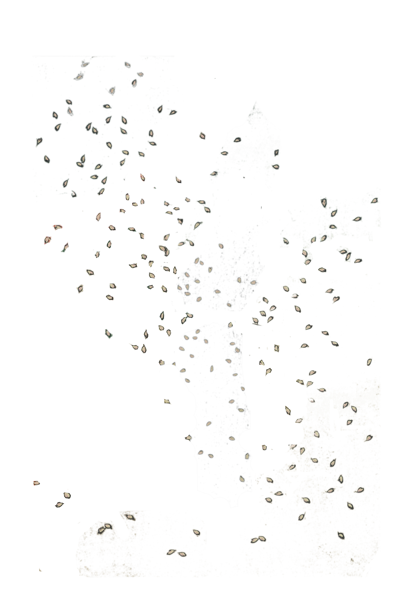

# Snowfall

Roll a foreground image over a background.

Used to create the Shinobuugakoa gif:

From the original

[Shinobugaoka no tsuki-Gyokuensai from Europeana](https://www.europeana.eu/portal/en/record/9200424/oai_digitool_bibnat_ro_246569.html)

I used GIMP to manually turn this into the three files

`python snowfall.py bg_eg.png fg_eg.png, mask_eg.png`
